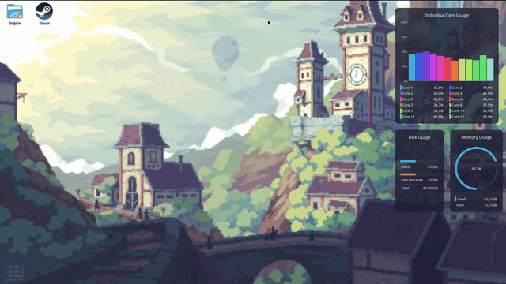
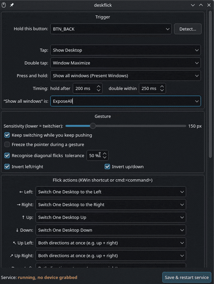

# deskflick

**Mouse gestures for KDE Plasma. Hold a mouse button, flick, and glide between
virtual desktops — or snap the window you're looking at.**

[](https://github.com/Batushn/deskflick/releases)
[](LICENSE)
[](#how-it-works)
[](#how-this-was-built)

<p align="center">
  
</p>

Your mouse has a spare button — the "back" thumb button on most mice. deskflick
turns it into a whole navigation layer:

| Gesture | Default |
| --- | --- |
| Hold + flick **← → ↑ ↓** | Switch virtual desktop that way |
| **Meta** + hold + flick | Snap the focused window that way (like Meta + arrows) |
| Hold + flick **↖ ↗ ↙ ↘** | Move one desktop on both axes at once |
| **Meta** + hold + flick **↖ ↗ ↙ ↘** | Snap the window into that corner |
| Tap | Show desktop |
| Double tap | Maximise window |
| Press and hold | Show all windows (Present Windows) |

Keep holding and keep pushing to fly across your whole desktop grid. Every one
of those is rebindable to any KWin shortcut or shell command, and a plain tap
can simply pass through as the button's original click.

## Requirements

- KDE Plasma 5 or 6, on **Wayland or X11**
- Python 3.11+ and `python-evdev`
- `pyside6` for the settings window (optional — the daemon runs without it)

Arch / CachyOS / Manjaro: `sudo pacman -S python-evdev pyside6`
Debian / Ubuntu: `sudo apt install python3-evdev python3-pyside6`
Fedora: `sudo dnf install python3-evdev python3-pyside6`

## Install

```bash
git clone https://github.com/Batushn/deskflick && cd deskflick && ./install.sh
```

That copies `deskflick` and `deskflick-ui` into `/usr/local/bin`, installs a
udev rule granting your session read access to **mouse** devices, and enables
the `deskflick` systemd **user** service. It asks for `sudo` once.

Then hold your mouse's back button and push. Settings live under **deskflick**
in your application menu.

> Some gaming mice send macros from a second HID interface, and reading those —
> plus the modifier-key state for Meta gestures — needs `input` group
> membership. The installer adds you; it takes effect after one logout.

An AUR package is planned; the `PKGBUILD` in this repo is ready for it.

## Configure



**GUI:** launch **deskflick** from the app menu (or run `deskflick-ui`). Pick
the trigger button from the list or press *Detect…* and press the button
itself; set what tap, double tap and hold do; bind all eight flick directions,
with and without the modifier. *Save & restart service* applies everything, and
the status line names the devices deskflick actually grabbed.

**Or by hand:** `~/.config/deskflick/config.toml`, created on install and fully
commented. `systemctl --user restart deskflick` to apply.

<br clear="right">

```toml
[trigger]
button = "BTN_SIDE"          # BTN_EXTRA, BTN_MIDDLE, KEY_* … see --watch
tap = "Show Desktop"         # passthrough | overview | none | any KWin shortcut
double = "Window Maximize"
hold = "overview"
hold_ms = 200
double_ms = 250

[gesture]
threshold = 150              # lower = twitchier
repeat = true                # keep pushing = keep switching
lock_pointer = false         # freeze the cursor mid-gesture
diagonals = true
diagonal_ratio = 0.5         # smaller axis / larger axis; 0.8 demands a true 45°
invert_x = true              # desktop switching only
invert_y = true

[actions]                    # any KWin shortcut, or "cmd:<shell command>"
left = "Switch One Desktop to the Left"
right = "Switch One Desktop to the Right"
up = "Switch One Desktop Up"
down = "Switch One Desktop Down"
up_left = "combine"          # run both component directions: up, then left
up_right = "combine"         # "none" instead falls back to the dominant axis
down_left = "combine"
down_right = "combine"
# any action can be a chain: "Switch One Desktop Up | Window Maximize"

[modifier]                   # hold this too -> act on the window, not the desktop
enabled = true
key = "KEY_LEFTMETA"         # or KEY_LEFTCTRL / KEY_LEFTALT / KEY_LEFTSHIFT
left = "Window Quick Tile Left"
up_left = "Window Quick Tile Top Left"
invert_x = false             # separate from [gesture]: snapping follows the hand
invert_y = false
suppress_press = true        # no tap/double/hold while the modifier is down
defuse_launcher = true       # keep a held Meta from opening the app launcher

[overview]
shortcut = "ExposeAll"       # what the "overview" keyword means
```

Every bindable KWin shortcut name:

```bash
gdbus call --session --dest org.kde.kglobalaccel --object-path /component/kwin --method org.kde.kglobalaccel.Component.shortcutNames
```

## Troubleshooting

```bash
deskflick --list-devices   # can deskflick see your mouse?
deskflick --watch          # press a button, see its exact name
deskflick -v               # run in the foreground, log every gesture
deskflick --unstick        # rescue: release all mouse buttons
journalctl --user -u deskflick -f
```

- **The button still does its old thing.** deskflick isn't grabbing it. The
  status line in `deskflick-ui` names every device it grabbed; if your mouse
  isn't there, it's a permissions problem — re-run `install.sh`, and log out
  once for macro buttons.
- **`deskflick --watch` prints nothing for that button.** It sends a keyboard
  macro from the mouse's onboard profile rather than a mouse button. Reading
  that needs `input` group membership: log out and back in after installing.
- **Meta gestures do nothing.** Same cause — reading the modifier state needs
  that group. The log says so explicitly.
- **A click feels stuck.** `deskflick --unstick`. It shouldn't happen:
  deskflick refuses to grab a mouse while a button is held, flushes releases
  through its clone before letting go, and runs `--unstick` after every service
  stop, even a kill.
- **Diagonals snap to the wrong corner.** Corner actions live in
  `[modifier]`, which has its own `invert_x`/`invert_y`. Binding a snap in
  plain `[actions]` inherits `[gesture]`'s inversion instead, which is tuned
  for desktop switching and will mirror the corner.
- **Desktops don't wrap around.** That's KWin's *Navigation wraps around*
  setting, under Window Management → Virtual Desktops.

## How it works

deskflick reads your mouse at the evdev level, grabs it, and mirrors every
event through a uinput clone — so the compositor never sees the trigger button
while a gesture is in progress, and the button keeps working normally when
you're not gesturing. Actions are invoked through KWin's own KGlobalAccel
shortcuts over D-Bus, so you get Plasma's real animations and OSD rather than a
reimplementation of them.

That design is why it behaves identically on Wayland and X11, and why it copes
with mice that scatter their buttons across several HID interfaces: the trigger
may live on a different device node than the motion, and deskflick grabs
whichever ones it needs.

While `[modifier]` is enabled it also opens your keyboards read-only, purely to
query the state of that one modifier key. It never grabs them, never reads the
key stream, and opens nothing at all when the feature is off.

## Uninstall

```bash
./uninstall.sh
```

## How this was built

Vibe coded with [Claude Code](https://claude.com/claude-code): every line of
this was written by Claude, from an idea described out loud — "I want to hold
mouse button 4 and flick between desktops" — and then shaped request by
request, bug report by bug report, against real hardware.

Worth knowing if you are reading the source or sending a patch: the whole
thing is two Python files, and the sharp edges it hit along the way are
recorded in the commit messages, which explain *why* rather than what. The
udev rule is numbered 71 for a reason. The gesture is judged on `SYN_REPORT`
for a reason. Those reasons cost real debugging.

## License

[MIT](LICENSE) — Batuhan Sahin
